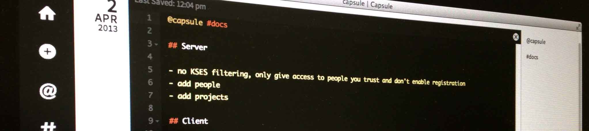
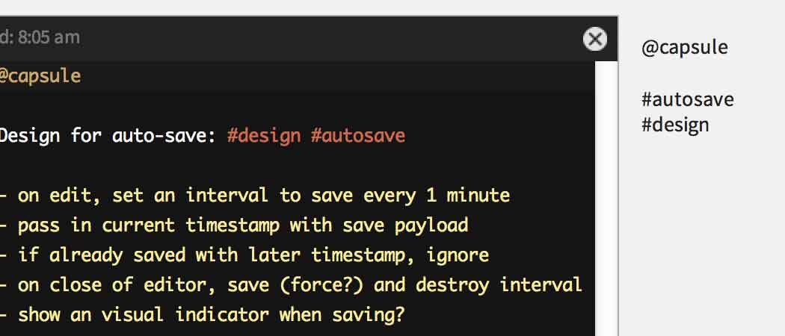
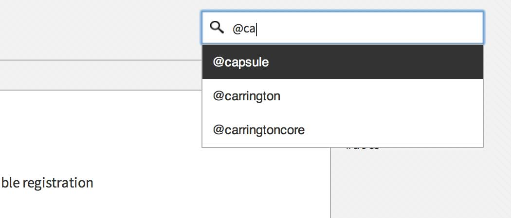
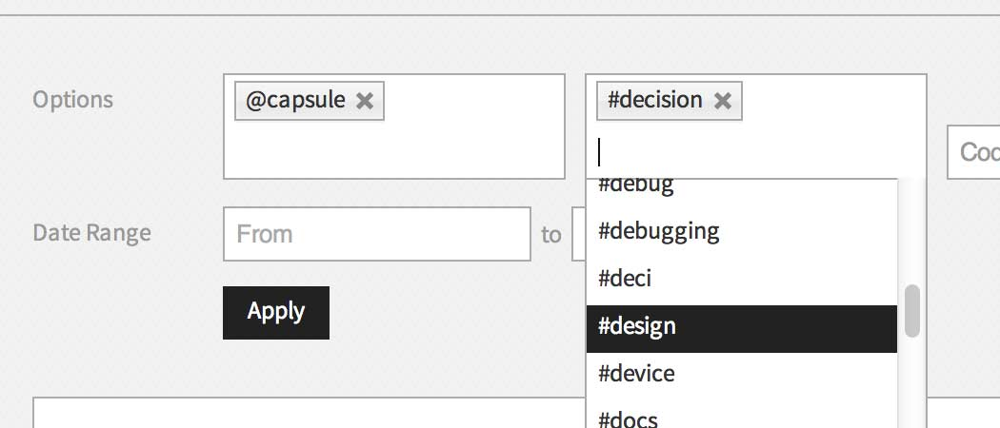
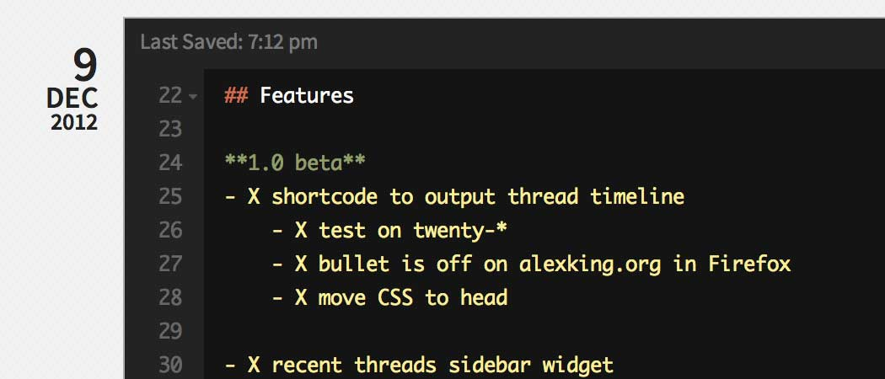
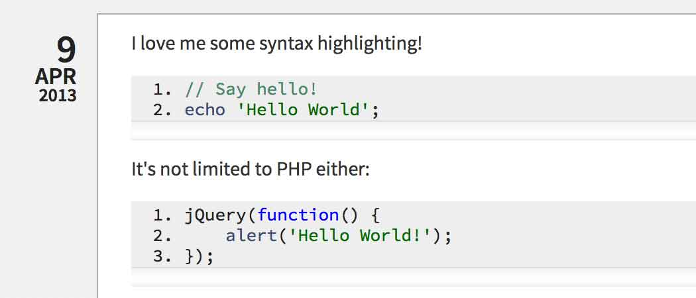

<div class="wrap capsule-admin">
	<div class="capsule-welcome">
		<h1>Capsule</h1>
		<p>The developer\'s code journal</p>
	</div>
	

	<div class="capsule-doc-col-left">
		<h3>Overview</h3>
		<p>Many developers keep a scratch document open next to their project code or IDE when they are coding. This document ends up containing miscellaneous artifacts: failed code attempts, data formats, math calculations, etc. Most of the time, this document gets thrown away.</p>
		<p>Capsule is a replacement for that scratch document. It archives and organizes your development artifacts for future reference.</p>
		<p>We have intentionally designed Capsule so that you you can stay on the front-end of the app for everything except administrative tasks (adding Capsule Servers, mapping projects, etc.).</p>

		<h3>Projects &amp; Tags</h3>
		<p></p>
		<p>Capsule stores metadata about your posts to make them easy to filter and find later. You can specify projects and tags for each post, just by entering them into the content of your post. Capsule uses the following syntax to parse projects and tags:</p>
		<ul>
			<li>Projects: @example, @example-project, @example.com</li>
			<li>Tags: #example, #example-tag, #example.com</li>
		</ul>
		<p>Simply include these in the content of your post and Capsule will find them and store them as standard WordPress taxonomy terms for your post.</p>
		<p>
			When creating projects or tags please be aware that these should explicitly not include a space character in their name. The reasoning behind this is that the parser cannot properly identify a project or tag containing a space character when trying to reference them in your capsule (document).
		</p>
		<p>
			Consider the following example:
		</p>
		<ol>
			<li>You have a project named “Project X”</li>
			<li>You are writing a new capsule (document)</li>
			<li>When trying to reference your project by using the @ symbol, you would write “@Project X”</li>
			<li>The parser reads this input as follows:
				<ol>
					<li>Assign this capsule to the project named “Project”</li>
					<li>What is left will be added to the content of your capsule, i.e: “ X”</li>
				</ol>
			</li>
		</ol>
		<h3>Search</h3>
		<p></p>
		<p>We\'re saving this information to make it useful in the future, so we\'ve got to be able to find it again. Capsule supports both keyword search and filtering by projects, tags, code languages and date range, whew! When using keyword search you can auto-complete projects, tags, and code languages by using their syntax prefix.</p>
		<p></p>
		<p>When filtering, multiple projects/tags/etc. can be selected and are all populated with auto-complete.</p>
	</div>
	<div class="capsule-doc-col-right">
		<h3>Editing</h3>
		<!-- 1050 x 450 -->
		<p></p>
		<p>Bring up the editor for a post by clicking the Edit icon or double-clicking on the post content.</p>
		<p>Capsule supports Markdown Extra syntax with one minor nuance. Since we are using hashtag notation to create tags for our posts, to create a title using Markdown syntax Capsule requires a space between the &quot;#&quot; and the title text. Example:</p>
		<ul>
			<li>Title: # I am a Title!</li>
			<li>Tag: #i-am-a-tag</li>
		</ul>
		<p>When you are editing a post, Capsule auto-saves for you every 10 seconds. There is an &quot;edited&quot; indicator in the upper left corner of the editor next to the Last Saved time. Of course you can also save explicitly at any time using the keyboard shortcut. Capsule also saves when you close the editor.</p>
		<p>If you want to keep a post easily accessible, you can star it and it will remain at the top of your posts list (until it is un-starred). You can star as many posts as you like.</p>

		<h3>Code Syntax Highlighting</h3>
		<p></p>
		<p>Capsule supports GitHub-style fenced code blocks, and syntax highlighting for code blocks.</p>
		<pre>
			```php
			// Say hello!
			echo 'Hello World';
			```
		</pre>
		<p>Additionally, when you use fenced code blocks Capsule saves the code language as metadata for your post.</p>

		<h3>Keyboard Shortcuts</h3>
		<table class="widefat">
			<thead>
				<tr>
					<th>&nbsp;</th>
					<th>Mac</th>
					<th>Windows</th>
				</tr>
			</thead>
			<tbody>
				<tr>
					<td>Save</td>
					<td>Command-S</td>
					<td>Control-S</td>
				</tr>
				<tr>
					<td>Re-center active editor</td>
					<td>Command-Shift-0</td>
					<td>Control-Shift-0</td>
				</tr>
				<tr>
					<td>Close active editor</td>
					<td>Esc</td>
					<td>Esc</td>
				</tr>
				<tr>
					<td>Indent current line</td>
					<td>Command-]</td>
					<td>Control-]</td>
				</tr>
				<tr>
					<td>Outdent current line</td>
					<td>Command-[</td>
					<td>Control-[</td>
				</tr>
				<tr>
					<td>Navigate Home</td>
					<td>Shift-H</td>
					<td>Shift-H</td>
				</tr>
				<tr>
					<td>Create New Post</td>
					<td>Shift-N</td>
					<td>Shift-N</td>
				</tr>
				<tr>
					<td>Set Focus to Search</td>
					<td>Shift-F</td>
					<td>Shift-F</td>
				</tr>
			</tbody>
		</table>
		<h3>Icon and Fluid Apps</h3>
		<p>Capsule works great with apps like Fluid that give you an application for a website. Need an icon for your app? Find it in the wp-content/themes/capule/ui/assets/icon/ dir.</p>
	</div>
	<br style="clear: both;">
	<hr>
	<div class="capsule-doc-col-left">
		<h3>Working With a Team</h3>
		<p>While Capsule is a tool for an individual developer, it is also a tool for team collaboration. You can connect to one or more Capsule Servers and replicate selected posts to those servers.</p>
		<ol>
			<li>
				Add a Capsule Server  (you must have an account on the Capsule Server)
			</li>
			<li>
				Connect to the Server's Projects
			</li>
		</ol>
		<p>Once you map a local project to a project on a Capsule Server, any posts for that project will be automatically replicated to the Capsule Server (if you want, you can send the same local project to multiple Capsule Servers). While you maintain your single development journal, you can connect to multiple Capsule Servers to coordinate with multiple development teams.</p>
		<p>The Capsule Server allows you to view posts by project, tag, developer, date range, and keyword search.</p>
	</div>
	<div class="capsule-doc-col-right">
		<h3>Capsule Server</h3>
		<p>Anyone can set up a Capsule Server. It is free, Open Source and built on WordPress; just like Capsule.</p>
		<p>Add users to your Capsule Server and they will be able to connect their Capsule journals to your Server.</p>
		<h3>Using dnsmasq</h3>
		<p>Many local development environments take advantage of dnsmasq to have pretty links for their local projects. However, please be aware that there is a common issue affecting cURL usage on environments with dnsmasq running as a service.</p>
		<p>As WP Capsule uses cURL to sync capsules, you might find that your local instance is not able to properly send information over to your defined WP Capsule Server.</p>
		<p>To check if your local domain properly resolves, use the terminal command dig, followed by your local URL (eg: dig mywebsite.localhost). In the response section of the output you should see an A record pointing to 127.0.0.1.</p>
	</div>
</div>
